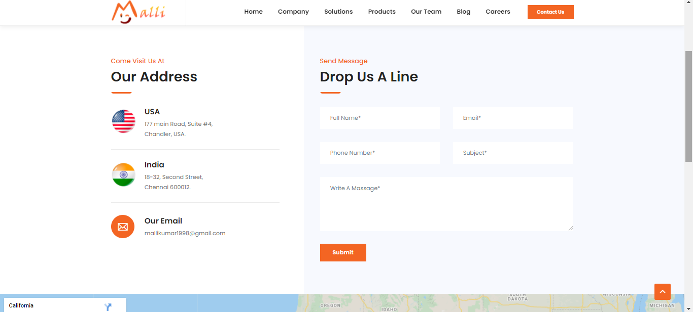

# Business_Dynamic_Website
Using Languages: <b>HTML5</b>, <b>CSS3</b>, <b>Bootstrap</b>, <b>Java Script</b>, <b>PHP</b>, <b>MySQL Database</b>
1. This Website <b>Blog</b> and <b>Career</b> pages are <b>dynaminc</b>, Once you update or add a data from your admin pannel reflect website front end.
2. If you apply a job from this website front end and then get a details and resume to <b>admin pannel</b>.
3. <b>Contact enquire</b>, <b>Subscribtion</b> list also get a admin pannel.
4. All details are export with <b>CSV format</b> in your local storage, resume view and download option also there.
5. If you want any <b>details</b> from this website or <b>admin pannel demo</b> please contact me <b>email: mallikumar1998@gmail.com</b>
6. This website bulid a responsive to any other devices like android mobile, laptop, etc.. 

<b>Website url: https://malli-business-site.herokuapp.com/</b>  
<b>Some Website page Screenshots - "Do you want to see clearly please click and view"</b> 
<table border="none">
  <tr>
    <td>Home page </td>
    <td>about page </td>
    </tr>
   <tr>
    <td>Blog page </td>
    <td>View Blog page </td>
    </tr>
   <tr>
    <td>Sloution page </td>
    <td>Contact page </td>
    </tr>
   <tr>
    <td>Career page </td>
    <td>Job apply page </td>
    </tr>
   <tr>
    <td>Responsive mobile view</td>
    <td>Mobile menu view </td>
    </tr>
  <tr>
    <td>Admin login</td>
    <td>Blog adding</td>
    </tr>
  <tr>
    <td>View|download resume</td>
    <td>Job adding </td>
    </tr>
 </table>
  
